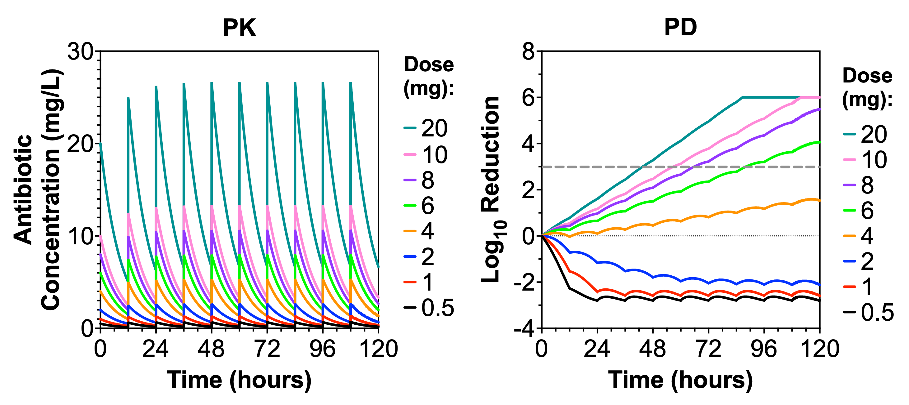

# PK/PD Antibiotic Modeling Project

## Overview

This project explores antibiotic treatment dynamics using a mechanistic pharmacokinetic–pharmacodynamic (PK/PD) model. The framework combines:

- one-compartment pharmacokinetics with first-order elimination  

- logistic bacterial growth  

- an Emax model for antibiotic-mediated bacterial killing  

The goal is to provide an interpretable and reproducible framework for exploring how dosing strategies and biological parameters influence antibacterial efficacy.

---

## Model Description

This project implements a mechanistic pharmacokinetic-pharmacodynamic (PK/PD) model to study antibiotic treatment dynamics.

The model is used to systematically evaluate how:
- drug exposure (dose, half-life, dosing interval)
- pharmacodynamic sensitivity (EC50)
- biological system properties (growth rate, initial burden)

influence bacterial response and treatment outcomes.

For a full description of the model framework, equations, assumptions, and simulation design, see:

- 📄 [Read full model description (GitHub)](docs/model_description.md)  

- ⬇️ [Download formatted report (PDF)](docs/model_description.pdf)

---

## Quick Start

To get started working with this project quickly:

- 📄 [Get Started (GitHub)](docs/getting_started.md)  

---

## What This Project Explores

This project is structured around three key questions:

1. **How does drug exposure influence treatment efficacy?**
   - Dose-response relationships  
   - Exposure thresholds and diminishing returns  

2. **How does pharmacodynamic potency affect response?**
   - Role of EC50 in shaping exposure-response relationships  

3. **How do biological factors influence outcomes?**
   - Growth rate effects  
   - Initial bacterial burden and time to control  

---

## Example Output

Below is an example of model output showing PK profiles and corresponding bacterial response:



---

## Key Findings

Using this modeling framework, several general trends can be explored:

- Increasing dose leads to higher exposure (AUC, Cmax) and improved bacterial killing  

- Antibacterial response is nonlinear, with threshold behavior emerging around EC50  

- Time above effective concentration plays a key role in sustained bacterial reduction  

- Initial bacterial burden shifts treatment duration but not underlying response dynamics  

- Log reduction and time-to-threshold provide complementary views of treatment efficacy  

These findings highlight how PK and PD factors jointly determine treatment outcomes.

---

## Repository Structure

```

PKPD-Antibiotic-Model/

├── README.md

├── requirements.txt

├── docs/

│   ├── getting_started.md

│   ├── model_description.md

│   └── model_description.pdf

├── notebooks/

│   └── pkpd_exploration.ipynb

├── src/

│   └── pkpd_model.py

├── figures/

└── outputs/

```

---

## Notes

- `src/` contains the reusable model implementation  

- `notebooks/` contains example workflows and analyses  

- `docs/` contains model documentation  

- The model is intended for exploratory and educational use  

